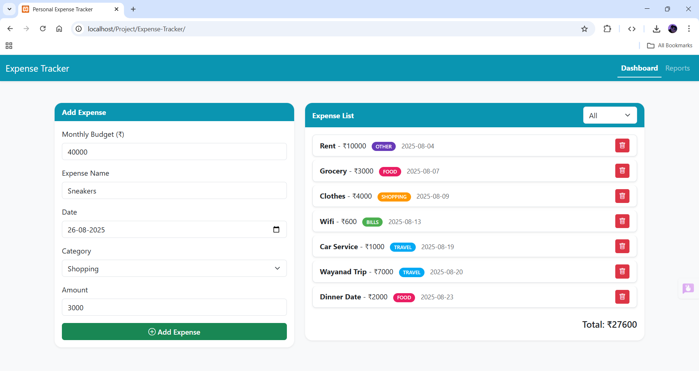
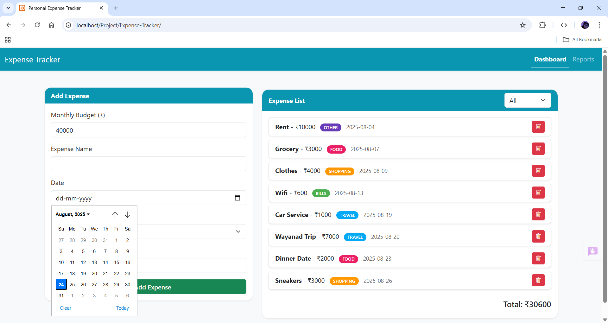
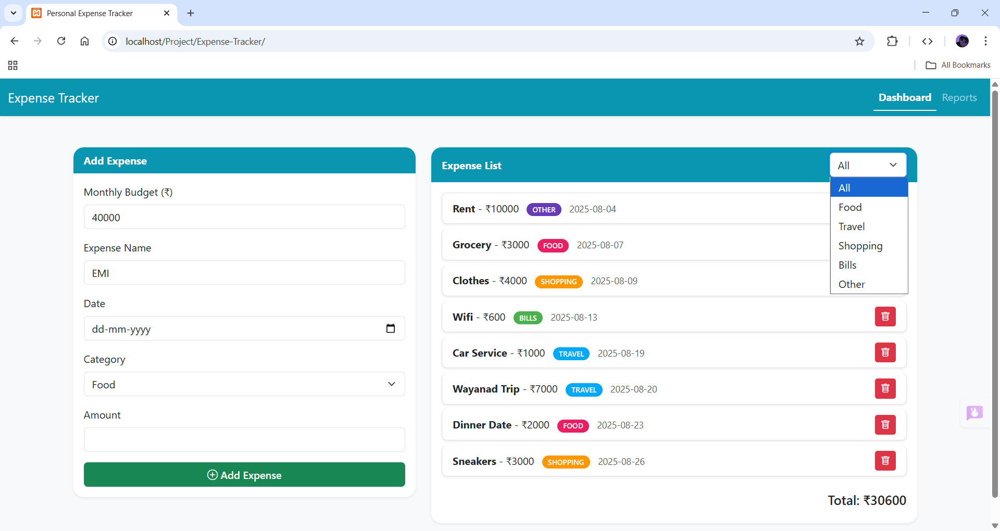
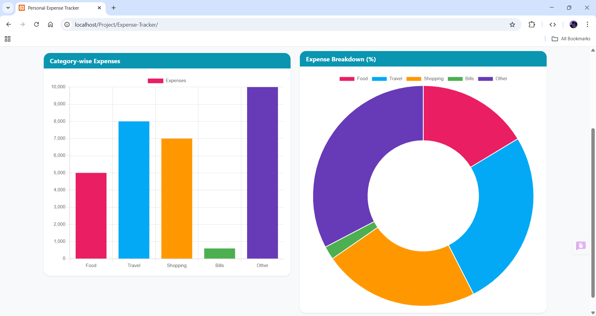

# Personal Expense Tracker  

A **Personal Expense Tracker** built using **HTML, CSS, JavaScript, Bootstrap, and Chart.js**, allowing users to add expenses, categorize spending, filter by category, and visualize expenses with charts. The app stores data in **Local Storage** so your expenses remain saved even after refreshing.

---

## 🚀 Features  
- ➕ Add, edit, and delete expenses  
- 🏷️ Categorize expenses (Food, Travel, Shopping, Bills, Other)  
- 🔎 Filter expenses by category  
- 📊 Visual charts for expense breakdown (bar & doughnut)  
- 📅 Calendar view to track expenses by date  
- 💰 Budget progress indicator  
- 📌 Responsive and user-friendly dashboard  

---

## 🛠️ Technologies Used  
- **Frontend:** HTML, CSS, Bootstrap 5, JavaScript  
- **Icons:** Bootstrap Icons  
- **Charts:** Chart.js  
- **Storage:** LocalStorage (for persistent data)  
- **Version Control:** Git & GitHub  

---

## 📸 Screenshots  

### 1. Dashboard with Populated List  
  

### 2. Calendar Feature  
  

### 3. Filtering by Category  
  

### 4. Visual Charts  
  

---

## 🌐 Live Demo  
[View the live project here](https://tanushrisv.github.io/personal_expense_tracker/)  

© 2025 Tanushri S V. All rights reserved.
